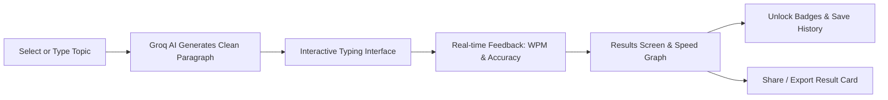

<div align="center">

# ⌨️ TypeQuest Pro (TypeLearn)

**Learn while you type — AI-powered educational touch typing practice.**

[](https://vitejs.dev/)
[](https://react.dev/)
[](https://www.typescriptlang.org/)
[](https://tailwindcss.com/)
[](https://groq.com/)

<br />

<p align="center">
  Traditional typing tests use random sentences or repetitive quotes. <strong>TypeQuest</strong> transforms your typing practice into active study sessions by generating concise, textbook-grade concept summaries on any topic you choose.
</p>

</div>

---

## 📑 Table of Contents

- [Overview](#-overview)
- [Key Features](#-key-features)
- [How It Works](#-how-it-works)
- [Keyboard Shortcuts](#-keyboard-shortcuts)
- [Achievements System](#-achievements-system)
- [Tech Stack](#-tech-stack)
- [Project Structure](#-project-structure)
- [Getting Started](#-getting-started)
  - [Prerequisites](#prerequisites)
  - [Installation](#installation)
  - [Environment Variables](#environment-variables)
  - [Development Server](#development-server)
  - [Build for Production](#build-for-production)
  - [Running Tests](#running-tests)
- [Configuration & Settings](#-configuration--settings)
- [Privacy & Storage](#-privacy--storage)
- [Contributing](#-contributing)
- [License](#-license)

---

## 💡 Overview

**TypeQuest Pro** is a high-performance typing practice application designed for students, programmers, and knowledge seekers. Instead of mindless repetition, every typing drill is an educational revision on topics like:

- 🔬 **Science**: *Photosynthesis, DNA Replication, Periodic Table, Quantum Physics*
- 📐 **Mathematics & Computing**: *Binary Search, Big-O Notation, Graph Theory*
- 📜 **History & Civics**: *World War II, Democracy, The Indian Constitution*
- 🎭 **Literature**: *Shakespeare, Epic Poetry, Modern Fiction*
- 💡 **Any Custom Topic**: Enter any term or concept to generate an instant lesson!

---

## ✨ Key Features

### 🤖 AI-Generated Educational Content
- **On-Demand Concept Generation**: Powered by **Groq Cloud API** (`openai/gpt-oss-120b`), generating informative, textbook-quality paragraphs tailored to your selected topic.
- **Difficulty Tiers**:
  - **Easy**: Short sentences, elementary school vocabulary.
  - **Medium**: High-school standard, balanced complexity.
  - **Hard**: Academic vocabulary and technical terminology.
- **Text Cleanliness Filters**: Automated stripping of preamble, chain-of-thought tokens, and unwanted symbols to ensure clean, typeable text.

### 🎮 Flexible Game Modes
- ⏱️ **Timed Mode**: 15s, 30s, 60s, 90s, or 120s sprint against the clock.
- 🎯 **Words Mode**: Target a specific volume (25, 50, 100, or 200 words).
- 🧘 **Zen Mode**: Relaxed, open-ended practice without timers or word limits.

### ⚡ Monkeytype-Grade Typing Experience
- **Fluid Carets**: Choose between **Bar (`|`)**, **Block (`█`)**, or **Underline (`_`)** with smooth CSS transitions.
- **Ghost Caret**: Optional preview indicator for smooth target tracking.
- **Dynamic Text Display**: 3-line rolling window with gradient masking and automatic line progression.
- **Error Shake & Instant Highlighting**: Immediate visual feedback for correct and misspelled characters.
- **Safety Checks**: Automatic **Caps Lock** warning notification and unfocused blur protection.

### 📊 In-Depth Analytics & Sharing
- **Real-Time Telemetry**: Live updates for WPM, accuracy percentage, and remaining time.
- **Speed Over Time Graph**: Visualized using **Recharts**, with a reference indicator against your target WPM.
- **Shareable Result Cards**: Built-in HTML5 Canvas generator produces high-resolution PNG summary cards. Easily shared via the Web Share API, copied to the clipboard, or downloaded directly.

### 🏆 Gamification & History
- **15 Unlockable Badges**: Track milestones for speed (40, 60, 80, 100, 120 WPM), accuracy (95%, 99%, 100%), volume, and topic exploration.
- **Session History**: Detailed logs of your past runs, including best scores grouped by topic.
- **Local-First**: All history, preferences, and achievements are stored directly in your browser (`localStorage`).

---

## 🚀 How It Works



1. **Pick or Enter a Topic**: Choose from pre-configured topic chips or type any subject you want to revise.
2. **AI Content Generation**: Groq constructs an educational summary adhering to your formatting rules, word count, and difficulty level.
3. **Practice & Type**: Focus with fluid carets, soundless visual cues, and instant error detection.
4. **Review & Progress**: Inspect your speed graphs, unlock achievements, and generate a branded share card.

---

## ⌨️ Keyboard Shortcuts

| Shortcut | Context | Action |
| :--- | :--- | :--- |
| <kbd>Enter</kbd> | Topic Selection | Start typing session with current input |
| <kbd>Space</kbd> *(when empty)* | Topic Selection | Pick a random "surprise me" topic |
| <kbd>Tab</kbd> + <kbd>Enter</kbd> | Typing Interface | Quick restart current test |
| <kbd>Esc</kbd> | Typing Interface | Back to topic selection (with confirmation modal) |
| <kbd>Tab</kbd> + <kbd>Enter</kbd> | Results Screen | Start a new topic |

---

## 🏅 Achievements System

TypeQuest features 15 built-in badges to reward your progress:

| Badge | Title | Requirement |
| :---: | :--- | :--- |
| 🎯 | **First Steps** | Complete your first typing test |
| 📚 | **Dedicated Learner** | Complete 10 typing tests |
| 💪 | **Practice Makes Perfect** | Complete 25 typing tests |
| 🏃 | **Typing Marathon** | Complete 50 typing tests |
| ⌨️ | **Getting Started** | Reach 40 WPM |
| ⚔️ | **Keyboard Warrior** | Reach 60 WPM |
| 🚀 | **Speed Demon** | Reach 80 WPM |
| 💯 | **Century Club** | Reach 100 WPM |
| ⚡ | **Lightning Fingers** | Reach 120 WPM |
| 🎯 | **Sharp Shooter** | Achieve 95% accuracy |
| 💎 | **Perfectionist** | Achieve 99% accuracy |
| ✨ | **Flawless** | Achieve 100% accuracy |
| 🗺️ | **Explorer** | Practice across 5 different topics |
| 🔥 | **Challenge Accepted** | Complete a test on Hard difficulty |
| 🏆 | **The Complete Package** | Achieve 80+ WPM with 95%+ accuracy |

---

## 🛠️ Tech Stack

- **Core Framework**: [React 18](https://react.dev/) with [TypeScript](https://www.typescriptlang.org/)
- **Bundler & Tooling**: [Vite](https://vitejs.dev/) with [@vitejs/plugin-react-swc](https://github.com/vitejs/vite-plugin-react-swc)
- **Styling**: [Tailwind CSS](https://tailwindcss.com/) with `tailwindcss-animate` and `@tailwindcss/typography`
- **UI Components**: [shadcn/ui](https://ui.shadcn.com/) powered by [Radix UI](https://www.radix-ui.com/)
- **Icons**: [Lucide React](https://lucide.dev/)
- **AI Backend**: [Groq SDK](https://github.com/groq/groq-typescript)
- **Data Visualization**: [Recharts](https://recharts.org/)
- **Notifications**: [Sonner](https://sonner.emilkowal.ski/)
- **Testing**: [Vitest](https://vitest.dev/) & [Testing Library](https://testing-library.com/)

---

## 📁 Project Structure

```text
TypeLearn/
├── public/                 # Favicon and static assets
├── src/
│   ├── components/         # Core application screens and UI components
│   │   ├── ui/             # Radix UI / shadcn component library
│   │   ├── HistoryScreen.tsx   # Past sessions, speed trends, & badge showcase
│   │   ├── ResultsScreen.tsx   # Post-test stats, Recharts graph, & canvas exporter
│   │   ├── TopicSelection.tsx  # Topic input, chips, & preference controls
│   │   └── TypingInterface.tsx # Typing arena with caret logic, auto-scroll, & timers
│   ├── hooks/              # Custom React hooks for state & game logic
│   │   ├── useAchievements.ts  # Gamification and badge tracking
│   │   ├── useHistory.ts       # Test history persistence & metrics aggregation
│   │   ├── usePreferences.ts   # User configuration management
│   │   ├── useTypingGame.ts    # Core typing engine: WPM, accuracy, caret offsets
│   │   └── use-toast.ts        # Toast notifications
│   ├── lib/                # Utility helpers (cn, clsx)
│   ├── test/               # Vitest unit test suites
│   ├── App.tsx             # Root application component & routing
│   ├── main.tsx            # React application mount point
│   └── index.css           # Global typography, color variables, & animations
├── .env.example            # Environment variable template
├── package.json            # Project dependencies and npm scripts
├── tailwind.config.ts      # Tailwind CSS configuration
├── tsconfig.json           # TypeScript configuration
└── vite.config.ts          # Vite configuration
```

---

## 🚀 Getting Started

### Prerequisites

- [Node.js](https://nodejs.org/) (version 18.0 or later)
- [npm](https://www.npmjs.com/) or [pnpm](https://pnpm.io/)
- A **Groq API Key** (available free of charge at [console.groq.com](https://console.groq.com/keys))

### Installation

1. **Clone the repository:**
   ```bash
   git clone https://github.com/jigyanshsahu/TypeLearn.git
   cd TypeLearn
   ```

2. **Install dependencies:**
   ```bash
   npm install
   ```

### Environment Variables

1. Copy `.env.example` to create your local `.env` file:
   ```bash
   cp .env.example .env
   ```

2. Add your Groq API key:
   ```env
   VITE_GROQ_API_KEY=gsk_your_actual_groq_api_key_here
   ```

> [!NOTE]
> The Groq API key is accessed in the browser via `import.meta.env.VITE_GROQ_API_KEY` to query model endpoints directly.

### Development Server

Start the local Vite development server:

```bash
npm run dev
```

Open your browser at `http://localhost:5173` to start typing!

### Build for Production

To create an optimized production build:

```bash
npm run build
```

To preview the built production bundle locally:

```bash
npm run preview
```

### Running Tests

Run the test suite using Vitest:

```bash
npm run test
```

Or run tests in watch mode:

```bash
npm run test:watch
```

---

## ⚙️ Configuration & Settings

TypeQuest provides in-depth personalization accessible via the **Appearance** panel:

- **Target WPM**: Slider from 20 to 200 WPM to calibrate your target benchmark.
- **Font Size**: Small, Medium, or Large text presentation.
- **Caret Style**: Choose between `|` (Bar), `█` (Block), or `_` (Underline).
- **Punctuation Toggle**: Enable/disable punctuation in generated passages.
- **Numbers Toggle**: Enable/disable numeric digits in generated passages.
- **Ghost Caret**: Toggle the smooth ghost indicator following your typing point.
- **Smooth Caret**: Toggle fluid CSS transition animation on the active cursor.

---

## 🔒 Privacy & Storage

- **100% Client-Side Storage**: All your typing history, preferences, and unlocked achievements are saved exclusively to your browser's `localStorage`.
- **No Tracking**: No telemetry or third-party user analytics are collected.
- **Direct API Calls**: Content prompts are sent directly from your client to Groq's high-speed inference endpoints.

---

## 🤝 Contributing

Contributions, issues, and feature suggestions are welcome!

1. Fork the repository
2. Create your feature branch: `git checkout -b feature/amazing-feature`
3. Commit your changes: `git commit -m "Add amazing feature"`
4. Push to the branch: `git push origin feature/amazing-feature`
5. Open a Pull Request

---

## 📄 License

This project is open source and available under the [MIT License](LICENSE).

<div align="center">
  <sub>Built with ❤️ for learners and typists everywhere.</sub>
</div>
